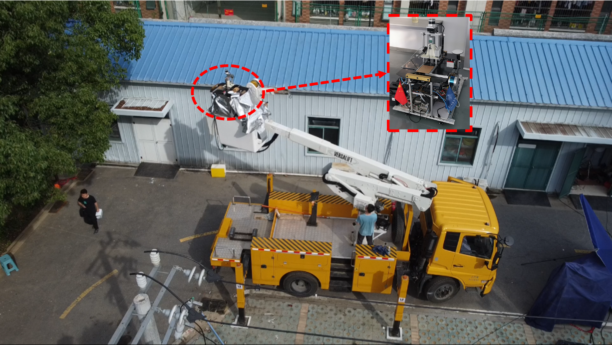

# [USTC FLICAR: A Sensors Fusion Dataset of Lidar-Inertial-Camera for Heavy-duty Autonomous Aerial Work Robots (IJRR 2023)](https://journals.sagepub.com/doi/abs/10.1177/02783649231195650)

### [Website: https://ustc-flicar.github.io/](https://ustc-flicar.github.io/)

# 📢 Updates

🚀 **23/01/2025**: Support the **SOTA** LIVO System: [Fast-LIVO2](https://github.com/hku-mars/FAST-LIVO2)!


🚀 **01/09/2024**: The [author](https://ustc-flicar.github.io/contact/) came to the [HKU MaRS Lab](https://mars.hku.hk/) for postgraduate study under supervised by [Prof. Fu Zhang](https://scholar.google.com/citations?user=V-eYCF8AAAAJ&hl=zh-CN&oi=ao) and continued his journey in robotics and SLAM


# Introduction



This site presents the USTC FLICAR Dataset, collected from our research on heavy-duty autonomous aerial work robots, featuring a comprehensive set of [sensors](https://ustc-flicar.github.io/sensors/):

* Four 3D LiDARs (Velodyne HDL32/VLP32; LiVOX Avia; Ouster OS0-128)
* Two stereo cameras (Bumblebee XB3/XB2)
* Two monocular cameras (Hikvison; FILR IR)
* Multiple Inertial Measurement Units (IMUs) 
* GNSS/INS system (Xsens MTI-G-710)
* Laser tracker for millimeter-level ground truth positions (API T3 Laser Tracker)

The dataset extends the typical autonomous driving sensing suite to aerial scenes, utilizing the “Giraffe” mapping robot based on a bucket truck. This platform is designed to explore the potential of combining autonomous driving perception systems with aerial work robots. Additionally, we introduce the Semantic FLICAR dataset, which provides fine-grained semantic segmentation annotations for multimodal continuous data in both temporal and spatial dimensions. 

# Citation
If you use some resource from this data suite, please cite it as

```
@article{wang2023ustc,
  title={USTC FLICAR: A sensors fusion dataset of LiDAR-inertial-camera for heavy-duty autonomous aerial work robots},
  author={Wang, Ziming and Liu, Yujiang and Duan, Yifan and Li, Xingchen and Zhang, Xinran and Ji, Jianmin and Dong, Erbao and Zhang, Yanyong},
  journal={The International Journal of Robotics Research},
  volume={42},
  number={11},
  pages={1015--1047},
  year={2023},
  publisher={SAGE Publications Sage UK: London, England}
}
```
[[Journal](https://journals.sagepub.com/doi/abs/10.1177/02783649231195650)][[Preprint](https://arxiv.org/pdf/2304.01986)]

# Downloads

<a name="tab-download"></a>
<table class="tg">
<thead>
  <tr>
    <th class="tg-6ibf">Name</th>
    <th class="tg-6ibf">Link</th>
    <th class="tg-6ibf">Size</th>
    <th class="tg-6ibf">Duration</th>
    <th class="tg-6ibf">Remark</th>
  </tr>
</thead>
<tbody>
  <tr>
    <td class="tg-v8dz">hf001</td>
    <td class="tg-6ibf"><a href="https://ustc-flicar.github.io/datasets/hf001/" target="_blank" rel="noopener noreferrer">.bag</a></td>
    <td class="tg-6ibf">66.5 GB</td>
    <td class="tg-6ibf">192.5 s<br>26.46 m</td>
    <td class="tg-v8dz">Collected in complex aerial work scenes with power lines, trees, and houses with bucket truck motion; Sun</td>
  </tr>
  <tr>
    <td class="tg-v8dz">hf002</td>
    <td class="tg-9m02"><a href="https://ustc-flicar.github.io/datasets/hf002/" target="_blank" rel="noopener noreferrer">.bag</a></td>
    <td class="tg-6ibf">75.7 GB</td>
    <td class="tg-6ibf">217.8 s <br> 33.5 m</td>
    <td class="tg-v8dz">The same scenes as above</td>
  </tr>
  <tr>
    <td class="tg-v8dz">hf003</td>
    <td class="tg-9m02"><a href="https://ustc-flicar.github.io/datasets/hf003/" target="_blank" rel="noopener noreferrer">.bag</a></td>
    <td class="tg-6ibf">83.2 GB</td>
    <td class="tg-6ibf">217.1 s <br> 34.26 m </td>
    <td class="tg-v8dz">The same scenes as above</td>
  </tr>
  <tr>
    <td class="tg-v8dz">hf004</td>
    <td class="tg-9m02"><a href="https://ustc-flicar.github.io/datasets/hf004/" target="_blank" rel="noopener noreferrer">.bag</a></td>
    <td class="tg-6ibf"> 82.0 GB</td>
    <td class="tg-6ibf">155.9 s <br> 24.1 m</td>
    <td class="tg-v8dz">The same scenes as above</td>
  </tr>
  <tr>
    <td class="tg-v8dz">hf005</td>
    <td class="tg-9m02"><a href="https://ustc-flicar.github.io/datasets/hf005/" target="_blank" rel="noopener noreferrer">.bag</a></td>
    <td class="tg-6ibf">90.3 GB</td>
    <td class="tg-6ibf">260.4 s <br> 24.1 m</td>
    <td class="tg-v8dz">The same scenes as above</td>
  </tr>
  <tr>
    <td class="tg-v8dz">hf006</td>
    <td class="tg-9m02"><a href="https://ustc-flicar.github.io/datasets/hf006/" target="_blank" rel="noopener noreferrer">.bag</a></td>
    <td class="tg-6ibf">86.3 GB</td>
    <td class="tg-6ibf">230.6 s <br> 33.9 m</td>
    <td class="tg-v8dz">The same scenes as above; cloud</td>
  </tr>
  <tr>
    <td class="tg-v8dz">hf007</td>
    <td class="tg-9m02"><a href="https://ustc-flicar.github.io/datasets/hf007/" target="_blank" rel="noopener noreferrer">.bag</a></td>
    <td class="tg-6ibf">67.5 GB</td>
    <td class="tg-6ibf">207.6 s <br> 34.32 m </td>
    <td class="tg-v8dz">The same scenes as above; dusk</td>
  </tr>
  <tr>
    <td class="tg-v8dz">hf008</td>
    <td class="tg-9m02"><a href="https://ustc-flicar.github.io/datasets/hf008/" target="_blank" rel="noopener noreferrer">.bag</a></td>
    <td class="tg-6ibf">91.3 GB</td>
    <td class="tg-6ibf">210.6 s <br> 30.78 m</td>
    <td class="tg-v8dz">The same scenes as above; night</td>
  </tr>
  <tr>
    <td class="tg-v8dz">hf009</td>
    <td class="tg-9m02"><a href="https://ustc-flicar.github.io/datasets/hf009/" target="_blank" rel="noopener noreferrer">.bag</a></td>
    <td class="tg-6ibf">101.3 GB</td>
    <td class="tg-6ibf">238.7 s <br> 35.42 m</td>
    <td class="tg-v8dz">The same scenes as above; night</td>
  </tr>
  <tr>
    <td class="tg-v8dz">hf010</td>
    <td class="tg-9m02"><a href="https://ustc-flicar.github.io/datasets/hf010/" target="_blank" rel="noopener noreferrer">.bag</a></td>
    <td class="tg-6ibf">91.7 GB</td>
    <td class="tg-6ibf">210 s <br> 16.06 m</td>
    <td class="tg-v8dz">The same scenes as above</td>
  </tr>
  <tr>
    <td class="tg-v8dz">hf011</td>
    <td class="tg-9m02"><a href="https://ustc-flicar.github.io/datasets/hf011/" target="_blank" rel="noopener noreferrer">.bag</a></td>
    <td class="tg-6ibf">25.5 GB</td>
    <td class="tg-6ibf">207 s <br> 17.81 m</td>
    <td class="tg-v8dz">The same scenes as above; dusk</td>
  </tr>
  <tr>
    <td class="tg-v8dz">hf012</td>
    <td class="tg-9m02"><a href="https://ustc-flicar.github.io/datasets/hf012/" target="_blank" rel="noopener noreferrer">.bag</a></td>
    <td class="tg-6ibf">121.1  GB</td>
    <td class="tg-6ibf">231 s <br> 26.15 m</td>
    <td class="tg-v8dz">The same scenes as above; dusk</td>
  </tr>
  <tr>
    <td class="tg-v8dz">hf013</td>
    <td class="tg-9m02"><a href="https://ustc-flicar.github.io/datasets/hf013/" target="_blank" rel="noopener noreferrer">.bag</a></td>
    <td class="tg-6ibf">100.9 GB</td>
    <td class="tg-6ibf">187 s <br> 26.25 m</td>
    <td class="tg-v8dz">The same scenes as above; night</td>
  </tr>
  <tr>
    <td class="tg-v8dz">hf014</td>
    <td class="tg-9m02"><a href="https://ustc-flicar.github.io/datasets/hf014/" target="_blank" rel="noopener noreferrer">.bag</a></td>
    <td class="tg-6ibf">119.2 GB</td>
    <td class="tg-6ibf">201 s <br> 25.57 m</td>
    <td class="tg-v8dz">The same scenes as above; night</td>
  </tr>
  <tr>
    <td class="tg-v8dz">hn001</td>
    <td class="tg-9m02"><a href="https://ustc-flicar.github.io/datasets/hn001" target="_blank" rel="noopener noreferrer">.bag</a></td>
    <td class="tg-6ibf">79.2 GB</td>
    <td class="tg-6ibf">390 s <br> 38.44 m</td>
    <td class="tg-v8dz">Collected in the 2th aerial work scene, including trucks, buildings, trees, etc.; IR</td>
  </tr>
  <tr>
    <td class="tg-v8dz">hn002</td>
    <td class="tg-9m02"><a href="https://ustc-flicar.github.io/datasets/hn002" target="_blank" rel="noopener noreferrer">.bag</a></td>
    <td class="tg-6ibf">56.1 GB</td>
    <td class="tg-6ibf">395 s <br> 44.97 m</td>
    <td class="tg-v8dz">Collected in the 3th aerial work scene, including trucks, buildings, etc.; IR</td>
  </tr>
  <tr>
    <td class="tg-v8dz">hn003</td>
    <td class="tg-9m02"><a href="https://ustc-flicar.github.io/datasets/hn003/" target="_blank" rel="noopener noreferrer">.bag</a></td>
    <td class="tg-6ibf">62.2 GB</td>
    <td class="tg-6ibf">442 s <br> 38.64 m</td>
    <td class="tg-v8dz">The same scenes as above</td>
  </tr>
  <tr>
    <td class="tg-v8dz">hn004</td>
    <td class="tg-9m02"><a href="https://ustc-flicar.github.io/datasets/hn004/" target="_blank" rel="noopener noreferrer">.bag</a></td>
    <td class="tg-6ibf">59.1 GB</td>
    <td class="tg-6ibf">417 s <br> 42.50 m</td>
    <td class="tg-v8dz">The same scenes as above</td>
  </tr>
  <tr>
    <td class="tg-v8dz"><span style="font-weight:400;font-style:normal">calib_data</span></td>
    <td class="tg-9m02"><a href="https://ustc-flicar.github.io/datasets/calibdata" target="_blank" rel="noopener noreferrer">.bag</a></td>
    <td class="tg-6ibf"> - </td>
    <td class="tg-6ibf"> - </td>
    <td class="tg-v8dz">IMU; Momo Stereo Camera; IMU-Camera; IMU-LiDAR, Camera-LiDAR; Multi-LiDARs Calib</td>
  </tr>
</tbody>
</table>

# Quick use

We have done some experiments of state-of-the-art methods on our the datasets. If you are seeking to do the same, please check out the following to get the work done quickly.

</style>
<table class="tg">
<thead>
  <tr>
    <th class="tg-c3ow">Method</th>
    <th class="tg-c3ow">Repository</th>
    <th class="tg-c3ow">Credit</th>
  </tr>
</thead>
<tbody>
  <tr>
    <td class="tg-0pky">Fast-LIO</td>
    <td class="tg-0pky"> <a href="https://github.com/ustc-flicar/ustcflicar-FAST-LIO"><span style="color:#905">https://github.com/ustc-flicar/ustcflicar-FAST-LIO</span></a></td>
    <td class="tg-0pky">Forked from https://github.com/hku-mars/FAST_LIO</td>
  </tr>
  <tr>
    <td class="tg-0pky">VINS-Fusion</td>
    <td class="tg-0pky"><a href="https://github.com/ustc-flicar/ustcflicar-VINS-Fusion"><span style="color:#905">https://github.com/ustc-flicar/ustcflicar-VINS-Fusion</span></a></td>
    <td class="tg-0pky">Forked from https://github.com/HKUST-Aerial-Robotics/VINS-Fusion</td>
  </tr>
  <tr>
    <td class="tg-0pky">VINS-Mono</td>
    <td class="tg-0pky"><a href="https://github.com/brytsknguyen/VINS-Mono"><span style="color:#905">https://github.com/brytsknguyen/VINS-Mono</span></a></td>
    <td class="tg-0pky">Forked from https://github.com/HKUST-Aerial-Robotics/VINS-Mono</td>
  </tr>
  <tr>
    <td class="tg-0pky">LIO-SAM</td>
    <td class="tg-0pky"><a href="https://github.com/ustc-flicar/ustcflicar-VINS-Fusion"><span style="color:#905">https://github.com/ustc-flicar/ustcflicar-VINS-Fusion</span></a></td>
    <td class="tg-0pky">Forked from https://github.com/TixiaoShan/LIO-SAM</td>
  </tr>
  <tr>
    <td class="tg-0pky">A-LOAM</td>
    <td class="tg-0pky"><a href="https://github.com/ustc-flicar/ustcflicar-A-LOAM"><span style="color:#905">https://github.com/ustc-flicar/ustcflicar-A-LOAM</span></a></td>
    <td class="tg-0pky">Forked from https://github.com/HKUST-Aerial-Robotics/A-LOAM</td>
  </tr>
</tbody>
</table>

# Licence
This work is licensed under a [Creative Commons Attribution-NonCommercial-ShareAlike 4.0 International License](https://creativecommons.org/licenses/by-nc-sa/4.0/) and is intended for non-commercial academic use.
If you are interested in using the dataset for commercial purposes please [contact us](zimingwang@connect.hku.hk).