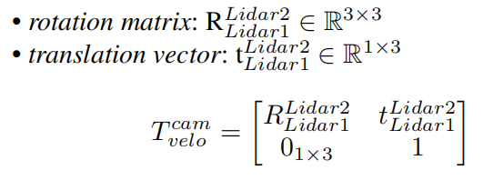

**Table of Contents**
{: #toc }
*  TOC
{:toc}

## Accurate Modeling
<td></td> 
We utilize the <a href='https://www.photoneo.com/products/phoxi-scan-l/'>Photoneo PhoXi 3D Scanner L</a> for precise modeling of the data acquisition multisensor platform. Its technical specifications are as follows: 
• Scanner Type: structured light scanner 
• Calibration Accuracy (1 σ): 0.200 mm 
• Temporal Noise (1 σ): 0.190 mm 
• Resolution: Up to 3.2 million 3D points 
• Scanning Range: 870 - 2150 mm 
• Optimal Scanning distance: 1239 mm 
• Scanning Area (sweet spot): 1082 x 772 mm 
• Point-to-Point Distance: 0.524 mm 
• Scanning Time: 250 - 2750 ms 
These specifications exemplify the Photoneo PhoXi 3D Scanner L’s capabilities, allowing for precise and detailed modeling for our multi-sensor platform. 
Multiple-angle modeling pointcloud of data acquisition platform with the PhoXi 3D scanner, SolidWorks assembly models, and drawings are provided along with the dataset. Before users run the calibration program using the USTC FLICAR dataset, we recommend referring to the structured light scanning modeling data and SolidWorks design models to obtain reliable initial calibration values.

Calibration Data of Photoneo scan and SolidWorks Model is available here:<a href="https://rec.ustc.edu.cn/share/82d29700-01d3-11ee-b53a-e1e918ec8e37">  Download</a>  

## Time Synchronization
<table><tr>

<td width="65%">

    

</td>

<td width="35%">
  
	The time synchronization module performs the time synchronization of the cameras, Lidars, IMU and computers that record the data. The first level of the time synchronization module is the GNSS receiving module, which obtains the UTC true time data with nanosecond precision through the satellite. The logic parallel circuit processes the timing information, converts the GNSS signal into PPS (Pulse-per-second signal) signal and NEMA signal, and the Lidar is connected to the two signals for time synchronization. At the same time, the PPS signal is connected to the IMU module and the frequency divider module. The PPS signal makes the inertia data timestamp of the IMU consistent with the true value of UTC time; the PPS signal connected to the frequency divider module is based on the The camera needs to be triggered at the frame rate. The camera trigger signal is aligned with the PPS signal at the edge of the whole second, and the delay between the two signals is within a few tens of ns. Therefore, the camera exposure image time is synchronized with the IMU data acquisition time; The camera time is time-synchronized during device manufacture, so the trigger signal triggers all cameras on the serial trigger line simultaneously. The computing master accepts the NTP network data packets converted and sent by the FPGA, and performs time synchronization through the NTP protocol.  
	
	For the horizontal Lidar and the stereo camera on the axis, a photoelectric trigger sensor is designed. When the Lidar rotates to coincide with the camera's field of view, the excitation switch is turned on and the camera is exposed to collect images to ensure the spatiotemporal synchronization of point clouds and images.
</td>
</tr></table>

## IMU
This part is about how we get IMU's gyroscope and accelerometer noise model parameters. The IMU sensor will drift over time, therefore
it is necessary to add an error term into the motion model
to correct the IMU raw data based on IMU noise model.

<td></td> 

**1. Record Data**
<table><tr>
<td width="50%"></td>
<td width="50%">Place the IMU stationary on a stable platform for about 4hours and record the data of IMU in a rosbag.    Calibration Data of IMU is available here:<a href="https://rec.ustc.edu.cn/share/f79e06a0-9293-11ed-afa1-714e585ec50a">  Download</a>  
</td>
</tr></table>

**2. Calibrate Tools**

The tools we use on our calibration are <a href="https://github.com/gaowenliang/imu_utils">imu_utils</a> and <a href="https://github.com/rpng/kalibr_allan">kalibr_allan</a>. Note that the unit of kalibr_allan result is different from that of imu_utils. If you use it, you need to pay attention to the unit conversion. Note that calibration is done in a nearly ideal static
setup. In a dynamic setting, the noise will be higher with
other factors such as temperature changes. Therefore, it is
beneficial to appropriately increase these parameters when
using IMU data for camera-IMU extrinsic calibration or
visual-inertial odometry.

## Cameras

In order to make full use of the metric information of 2D
images for 3D tasks, we calibrate the internal parameters
of each camera and the external parameters between stereo
cameras. The calibration approach we use is proposed by
Zhang [2000]. A known prior size checkerboard is placed at
different distances and attitudes relative to the cameras, the cameras collect images at a fixed frame rate as calibration
data and the cameras in same stereo pair are triggered
synchronously. Matlab provides a convenient calibration toolbox for mono and stereo cameras calibration. <a href="https://www.mathworks.com/help/vision/ug/using-the-single-camera-calibrator-app.html">matlab_mono_calib</a> / <a href="https://www.mathworks.com/help/vision/ug/using-the-stereo-camera-calibrator-app.html">matlab_stereo_calib</a> (we have tested on matlab 2020b and matlab 2022b, other version of matlab may have some bugs like matlab 2021)

### Mono Cameras
There are 8 mono cameras in the system: 
Bumblebee_xb3 left/center/right 
Bumbelbee_xb2 left/right 
Hikvision_1 
Hikvision_2  

    

**The size of the calibration plate in the picture is 10 x 7, 80mm x 80mm**

### Stereo Cameras

<a href="https://github.com/yzrobot/bumblebee_xb3/wiki/Stereo-vision-bumblebee-xb3-by-anshulpaigwar">Bumblebee_xb3 link</a>

    

The results Camera parameters are provided in OpenCV format. To convert MATLAB results to OpenCV format, you need to transpose the projection and rotation matrices. See this <a href="https://stackoverflow.com/questions/46651936/convert-between-matlab-stereoparameters-and-opencv-stereorectify-stereo-calibrat/50925828#50925828">link</a> for details. 
The camera parameters are notated as: 

    

Here, the *distortion_coefficients* vector is used to rectify
the tangential and radial distortion of images, using pinhole
camera distortion model. The *rectification_matrix* is only
applicable to stereo cameras, which is used to align the
epipolar lines between two stereo images for 3D stereo vision
geometry calculation. It is identity matrix for monocular
cameras. The camera projection matrix is used to project objects in
the 3D world to the camera 2D image pixels:

    

The left 3 × 3 portion is the intrinsic camera matrix for
the rectified image. The fourth column [Tx Ty 0]T
is to translate the optical center of the second camera
to the position in the frame of the first camera. For
monocular cameras, Tx = Ty = 0. The average calibration
error of monocular cameras is about 0.08 pixel and average
calibration error of stereo cameras is about 0.1 pixel.

Calibration Data of IMU is available here:<a href="https://rec.ustc.edu.cn/share/fb8a2e90-9294-11ed-a4ea-9b0535fe17ec">  Download</a>

<table>
    <tr>
        

    </tr>
</table>

## Camera-IMU
The fusion of visual and inertial sensors will greatly improve
the robustness of the visual based SLAM system. The
camera provides high resolution external measurements of
the environment, while the IMU measures the internal ego-
motion of the sensor platform.

### Time estimate
<table><tr>
<td width="50%"></td>
<td>  The time synchronization accuracy between the IMU and the
monocular camera is shown in left. Time drift between
the IMU clock reference PPS signal and the camera trigger
signal is within 0.2 ms.   The time resolution of the abscissa from top to bottom
is 200ms, 20ms and 2ms, from a Tektronix MDO3024
oscilloscope.   Yellow: 1Hz PPS signal br> Blue: 20Hz camera
trigger signal. </td>
</tr></table>

### Transformation
We use <a href="https://github.com/ethz-asl/kalibr">Kalibr</a> to calib IMU and Cameras. The camera and IMU are rigidly fixed with the base bracket.
The overall visual-inertial system performs translation along
the XYZ three-axis and full rotation around each axis in front
of a AprilTag Olson [2011] grid sequences with known size,
and records the data for calibration.
<table>
    <tr>
        

    </tr>
</table>
camera-IMU extrinsics in the corresponding yaml file are
as followed:
<table>
    <tr>
        

    </tr>
</table>
The reprojection error of the camera-IMU extrinsic
parameter calibration is shown above, for most images
the reprojection error is within 1.0 pixel. For reprojection
error, the mean is 0.352 pixel, the median is 0.321 pixel, and
the standard deviation is 0.197 pixel.

Calibration Data of Camera-IMU is available here:<a href="https://rec.ustc.edu.cn/share/0a2f5ec0-929b-11ed-b688-21e496c91159">Download</a>

<table>
    <tr>
        

    </tr>
</table>

## LiDAR-IMU
<table>
    <tr>
        

    </tr>
</table>

Calibration Data of LiDAR-IMU is available here:<a href="https://rec.ustc.edu.cn/share/7c428e20-9294-11ed-9e15-757feb9fa44c">Download</a>

<table>
    <tr>
        

    </tr>
</table>

## Multiple-LiDAR
<table><tr>
<td width="40%"></td>
<td> A single Lidar has problems such as low information density
and vertical blind spots. Therefore, we equip the aerial
platform with Lidars from different angles for environmental
perception. External parameter calibration between multiple
Lidars is a prerequisite for the fusion of Lidar data.
The principle of our multi-Lidar external parameter
calibration method is based on the NDT (Normal
Distributions Transform) algorithm. The basic idea of the
NDT algorithm for external parameter calibration is to
construct a probability distribution map of the environment
map by analyzing and clustering the Lidar data, then match
the probability distribution, finally obtain the pose transform with the highest fitting degree between the pointclouds of the
two Lidars.   The point clouds obtained from the calibration
process are shown in left. The red point clouds are data obtained from the
horizontal Lidar Velodyne HDL32E, and green point clouds are
rom the vertical Lidar Velodyne VLP32C </td>
</tr></table>

<table>
    <tr>
        

    </tr>
</table>

<table><tr>
<td width="70%"></td>
<td width="30%">    Calibration Data of Multi LiDAR is available here:<a href="https://rec.ustc.edu.cn/share/7ae22e10-020d-11ee-acd3-a7a8bde1ab07">  Download</a>  
</td>
</tr></table>

## LiDAR-Camera
Image data has rich and dense object information, but
lacks the depth information of the picture. The Lidar data
can just make up for this defect, giving accurate depth information and object structure information. In the process
of 3D target detection, the fusion of image and Lidar
pointcloud information can achieve higher accuracy.
Accurate camera-Lidar calibration is a necessary condition for the fusion. We use the method proposed by <a href="https://github.com/beltransen/velo2cam_calibration">Velo2cam</a> to get the extrinsic parameters of Lidar
and cameras. Figure below illustrates the calibration scene and
effect of Velo2cam. A special calibration board with four
ArUco tags and four circular reference holes is placed at
different positions as calibration target. The 3D pose of each
ArUco marker relative to the cameras is obtained by solving
a classic perspective-n-point (PnP) problem to obtain the 3D
position of the reference holes and its orientation in space.

    

camera-Lidar extrinsics in the corresponding yaml file are
as followed:
<table>
    <tr>
        

    </tr>
</table>

Calibration Data of LiDAR-IMU is available here:<a href="https://rec.ustc.edu.cn/share/4ffaaac0-9295-11ed-af29-194f1dafd586">Download</a>

<table>
    <tr>
        

    </tr>
</table>
