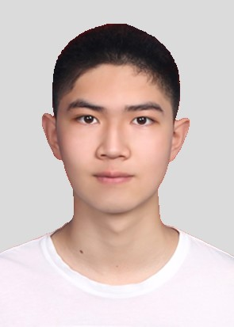

This is an introduction about myself. I am dedicated to robotics research with the goal of improving the quality of human life through the development of robots. I believe that effective collaboration between humans and robots can free us from tedious, physically demanding, and hazardous work, and provide vulnerable groups with greater opportunities to engage with the world. As a testament to this belief, I have created the USTC FlyingCar dataset to help prepare robots for the task of aerial work. I am also currently dedicated to advancing the application of robots in challenging environments such as high-voltage power lines and mines. My approach to research centers on robot perception as a means of exploring effective modes of human-robot fusion interaction. I am particularly focused on areas such as simultaneous localization and mapping (SLAM), computer vision (CV), human-robot interaction (HRI), and augmented/virtual/mixed reality (AR/VR/MR). In the future, I also hope to study robots that can assist the disabled and elderly. If we share similar goals, I look forward to connecting with you.

### Contact me:
<td width="750" align="left" valign="middle" class="rightone">
    <li>Email: <a href="mailto:&#119;&#109;&#049;&#051;&#048;&#051;&#057;&#050;&#055;&#056;&#056;&#054;&#054;&#064;&#109;&#097;&#105;&#108;&#046;&#117;&#115;&#116;&#099;&#046;&#101;&#100;&#117;&#046;&#099;&#110;">zimingwang@mail.ustc.edu.cn</a></li>
    <li>Tel.: +86 13179243157</li>
</td>    

### Basic Information
<td width="750" align="left" valign="middle" class="rightone">
            &nbsp;Ziming Wang, born on March 6, 2001 in <a href="https://en.wikipedia.org/wiki/Jilin_City">Jilin City</a>, Jilin Province, who is a senior at <a href="https://en.wikipedia.org/wiki/University_of_Science_and_Technology_of_China">University of Science and Technology of China(USTC)</a> now.  
            &nbsp;2015.9-2018.6. A student at <a href="https://en.wikipedia.org/wiki/Jilin_City_No.1_High_School">Jilin City No.1 High School</a> 
            &nbsp;2018.9-2019.9. EE Major at <a href="https://en.sist.ustc.edu.cn/main.htm">School of Information Science, USTC</a>  
            &nbsp;2019.9-2020.9. ME Major at School of Engineering Science, USTC 
            &nbsp;2020.9-now. CS Major at <a href="https://en.cs.ustc.edu.cn/main.htm">School of Computer Science, USTC</a>
</td> 

