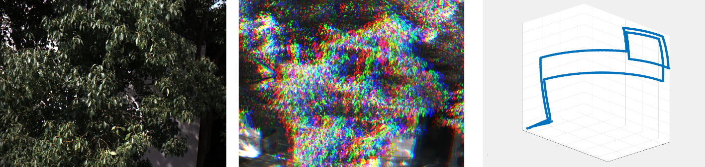
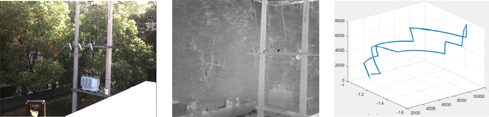
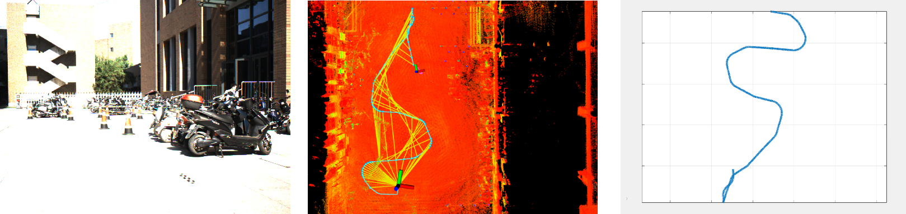
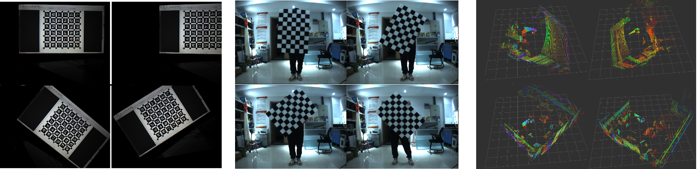

##### Before downloading individual datasets, you can find some useful tools and SDK from the <a href="../quick_use">quick use</a> page. 

      

         
      

      

         <a href="./hf001">
            <h4>HF001</h4>
         </a>
         Time: 2022/06/08-15:35 GMT +8 
         Size: 66.5 GB 
         aerial
         sun
      

      

         
      

      

         <a href="./hf002">
            <h4>HF002</h4>
         </a>
         Time: 2022/06/08-15:48 GMT +8 
         Size: 75.7 GB 
         aerial
         sun
      

      

         
      

      

         <a href="./hf003">
            <h4>HF003</h4>
         </a>
         Time: 2022/06/08-16:13 GMT +8 
         Size: 83.2 GB 
         aerial
         sun
         rotation
      

      

         
      

      

         <a href="./hf004">
            <h4>HF004</h4>
         </a>
         Time: 2022/06/08-16:30 GMT +8 
         Size: 82.0 GB 
         aerial
         clouds
         sun
      

      

         
      

      

         <a href="./hf005">
            <h4>HF005</h4>
         </a>
         Time: 2022/06/08-17:20 GMT +8 
         Size: 90.3 GB 
         aerial
         sun
      

      

         
      

      

         <a href="./hf006">
            <h4>HF006</h4>
         </a>
         Time: 2022/06/08-18:13 GMT +8 
         Size: 86.3 GB 
         aerial
         clouds
      

      

         
      

      

         <a href="./hf007">
            <h4>HF007</h4>
         </a>
         Time: 2022/06/08-19:01 GMT +8 
         Size: 67.5 GB 
         aerial
         dusk
         rotation
      

      

         
      

      

         <a href="./hf008">
            <h4>HF008</h4>
         </a>
         Time: 2022/06/08-21:20 GMT +8 
         Size: 91.3 GB 
         aerial
         night
         rotation
      

      

         
      

      

         <a href="./hf009">
            <h4>HF009</h4>
         </a>
         Time: 2022/06/08-21:27 GMT +8 
         Size: 101.3 GB 
         aerial
         night
         rotation
      

      

         
      

      

         <a href="./hf010">
            <h4>HF010</h4>
         </a>
         Time: 2022/06/07-18:19 GMT +8 
         Size: 91.7 GB 
         aerial
         clouds
         extra down-looking camera
      

      

         
      

      

         <a href="./hf011">
            <h4>HF011</h4>
         </a>
         Time: 2022/06/07-19:13 GMT +8 
         Size: 25.5 GB 
         aerial
         dusk
         extra down-looking camera
      

      

         
      

      

         <a href="./hf012">
            <h4>HF012</h4>
         </a>
         Time: 2022/06/07-19:26 GMT +8 
         Size: 121.1 GB 
         aerial
         dusk
         extra down-looking camera
      

      

         
      

      

         <a href="./hf013">
            <h4>HF013</h4>
         </a>
         Time: 2022/06/07-20:40 GMT +8 
         Size: 100.9 GB 
         aerial
         night
         extra down-looking camera
      

      

         
      

      

         <a href="./hf014">
            <h4>HF014</h4>
         </a>
         Time: 2022/06/07-20:54 GMT +8 
         Size: 119.2 GB 
         aerial
         night
         extra down-looking camera
      

      

         
      

      

         <a href="./hn001">
            <h4>HN001</h4>
         </a>
         Time: 2023/04/07-15:53 GMT +8 
         Size: 79.2 GB 
         aerial
         sun
         rotation
         extra IR camera
      

      

         
      

      

         <a href="./hn002">
            <h4>HN002</h4>
         </a>
         Time: 2023/04/07-12:12 GMT +8 
         Size: 56.1 GB 
         aerial
         sun
         rotation
         extra IR camera
      

      

         
      

      

         <a href="./hn003">
            <h4>HN003</h4>
         </a>
         Time: 2023/04/07-12:23 GMT +8 
         Size: 62.2 GB 
         aerial
         sun
         rotation
         extra IR camera
      

      

         
      

      

         <a href="./hn004">
            <h4>HN004</h4>
         </a>
         Time: 2023/04/07-13:02 GMT +8 
         Size: 59.1 GB 
         aerial
         sun
         rotation
         extra IR camera
      

      

         
      

      

         <a href="./gr001">
            <h4>GR001</h4>
         </a>
         Time: 2022/06/15-15:50 GMT +8 
         Size: 35.9 GB 
         ground
         sun
         trun
      

      

         
      

      

         <a href="./gr002">
            <h4>GR002</h4>
         </a>
         Time: 2022/06/15-19:13 GMT +8 
         Size: 12.1 GB 
         ground
         dusk
         trun
      

      

         
      

      

         <a href="./gr003">
            <h4>GR003</h4>
         </a>
         Time: 2022/06/15-19:24 GMT +8 
         Size: 19.5 GB 
         ground
         dusk
         trun
      

      

         
      

      

         <a href="./gr004">
            <h4>GR004</h4>
         </a>
         Time: 2022/06/15-19:34 GMT +8 
         Size: 25.7 GB 
         ground
         dusk
         trun
      

      

         
      

      

         <a href="./calibdata">
            <h4>Calibration</h4>
         </a>
         indoor
         calibration
      

# ...

### Stay tuned for more data!