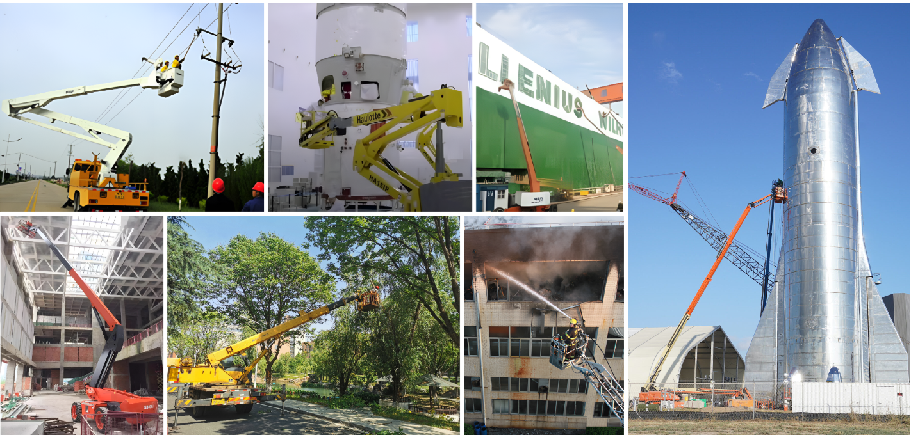

---
#
# Use the widgets beneath and the content will be
# inserted automagically in the webpage. To make
# this work, you have to use › layout: frontpage
#
layout: frontpage
header:
  image_fullwidth: header_unsplash_12.jpg
permalink: /index.html

widget1:
  title: "Downloads"
  url: '/datasets/index.html'
  image: unsplash_9.jpg
  text: ''
widget2:
  title: "Acquisition System"
  url: '/system/index.html'
  image: acquisition_index.png
  text: ''
widget3:
  title: "Sensors & Usage"
  url: '/sensors/index.html'
  image: sensors_page1.png
  text: ''
#
# Use the call for action to show a button on the frontpage
#
# To make internal links, just use a permalink like this
# url: /getting-started/
#
# To style the button in different colors, use no value
# to use the main color or success, alert or secondary.
# To change colors see sass/_01_settings_colors.scss
#

#
# This is a nasty hack to make the navigation highlight
# this page as active in the topbar navigation
#
homepage: true
---

# Welcome to USTC FLICAR Dataset!
### — USTC FLICAR: A Sensors Fusion Dataset of Lidar-Inertial-Camera for Heavy-duty Autonomous Aerial Work Robots
## 📢 Updates

🚀 **23/01/2025**: Support the **SOTA** LIVO System: [Fast-LIVO2](https://github.com/hku-mars/FAST-LIVO2) !

🚀 **01/09/2024**: The [author](https://ustc-flicar.github.io/contact/) came to the [HKU MaRS Lab](https://mars.hku.hk/) for postgraduate study under supervised by [Prof. Fu Zhang](https://scholar.google.com/citations?user=V-eYCF8AAAAJ&hl=zh-CN&oi=ao) and continued his journey in robotics and SLAM

### Introduction
##### We present the *[USTC FLICAR Dataset](https://journals.sagepub.com/doi/abs/10.1177/02783649231195650)*, which is dedicated to the development of simultaneous localization and mapping  and precise 3D reconstruction of the workspace for heavy-duty autonomous aerial work robots. In recent years, numerous public datasets have played significant roles in the advancement of autonomous cars and UAVs. However, these two platforms differ from aerial work robots: UAVs are limited in their payload capacity, while cars are restricted to two-dimensional movements. To fill this gap, we create the “Giraffe" mapping robot based on a bucket truck, which is equipped with a variety of well-calibrated and synchronized sensors: four 3D LiDARs, two stereo cameras, two monocular cameras, Inertial Measurement Units (IMUs), and a GNSS/INS system. A laser tracker is used to record the millimeter-level ground truth positions. We also make its ground twin, the “Okapi" mapping robot, to gather data for comparison. The proposed dataset extends the typical autonomous driving sensing suite to aerial scenes, demonstrating the potential of combining autonomous driving perception systems with bucket trucks to create a versatile autonomous aerial working platform. Moreover, based on the Segment Anything Model (SAM), we produce the Semantic FLICAR dataset, which provides fine-grained semantic segmentation annotations for multimodal continuous data in both temporal and spatial dimensions.

<!--
### Do you like the project? Star us on GitHub to support the project!

-->

## Are We Ready for Aerial Work Robots?   Or Be Bolder, Build on Mars?

<table>
  <tr>
    <td></td>
  </tr>
</table>

### Some aerial work scenarios in our daily life:
<table>
  <tr>
    <td></td>
  </tr>
</table>

