### VINS-Mono / VINS-Fusion

<a href="https://github.com/ustc-robot/ustcflyingcar-VINS-Mono">https://github.com/ustc-robot/ustcflyingcar-VINS-Mono</a> 

    

### ORB-SLAM3

### A-LOAM

    

Fig 1. A-LOAM with Velodyne HDL32E data from HF001 sequence

    

Fig 2. A-LOAM with Velodyne VLP32C data from HF001 sequence

### LeGO-LOAM

    

Fig 1. LeGO-LOAM with Velodyne HDL32E data from HF001 sequence

    

Fig 2. LeGO-LOAM with Velodyne VLP32C data from HF001 sequence

### LIO-SAM
<a href="https://github.com/ustc-robot/ustcflyingcar-LIO-SAM">https://github.com/ustc-robot/ustcflyingcar-LIO-SAM</a> 

    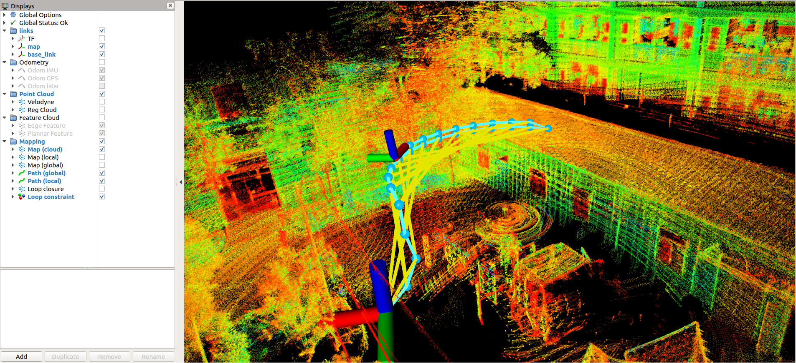

### FAST-LIO
<a href="https://github.com/ustc-robot/ustcflyingcar-FAST-LIO">https://github.com/ustc-robot/ustcflyingcar-FAST-LIO</a> 

    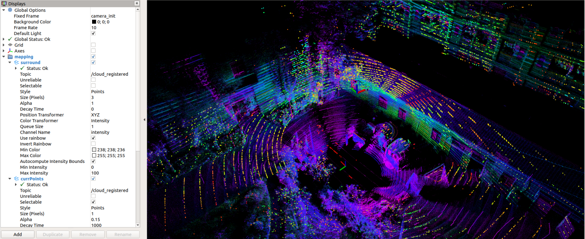

Fig 1. FAST-LIO with Velodyne HDL32E data and Xsens MTi-G-710 data from HF001 sequence 

    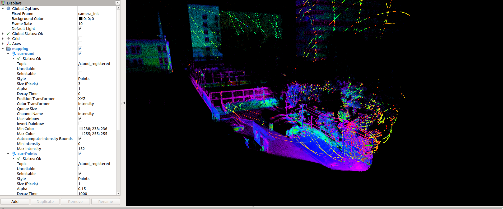

Fig 2. FAST-LIO with LiVOX Avia(Lidar and imu) data from HF001 sequence

### Evaluation:EVO

Fig 1. Overview

<table>
 <td width="50%">
 <table>
	<tr>
      <td rowspan="5">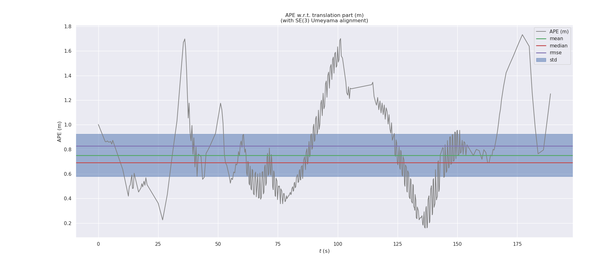</td>
	</tr>
 </table>
</td>
<td>
 <table>
	<tr>
      <td rowspan="5">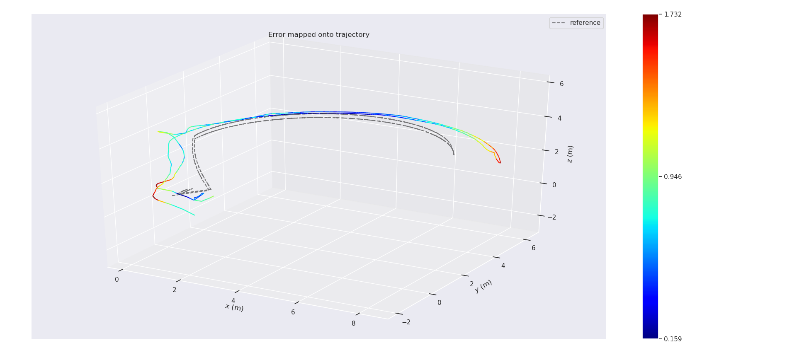</td>
	</tr>
 </table>
</td>
</table>

Fig 2. Vins-mono

<table>
 <td width="50%">
 <table>
	<tr>
      <td rowspan="5">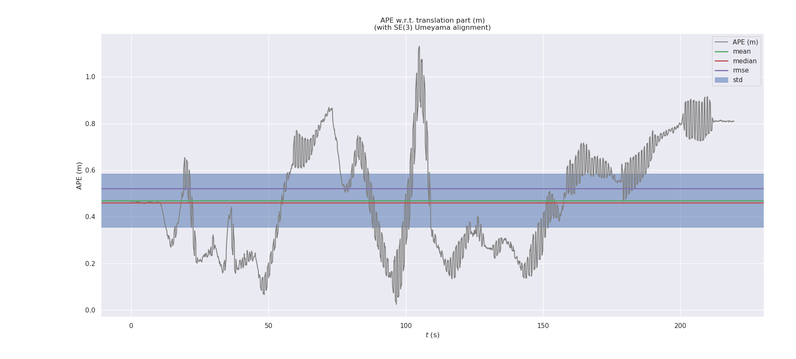</td>
	</tr>
 </table>
</td>
<td>
 <table>
	<tr>
      <td rowspan="5">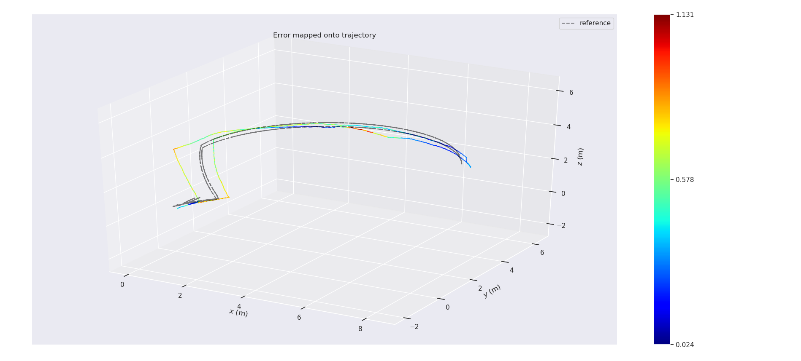</td>
	</tr>
 </table>
</td>
</table>

Fig 3. A-LOAM (VLP32)

<table>
 <td width="50%">
 <table>
	<tr>
      <td rowspan="5">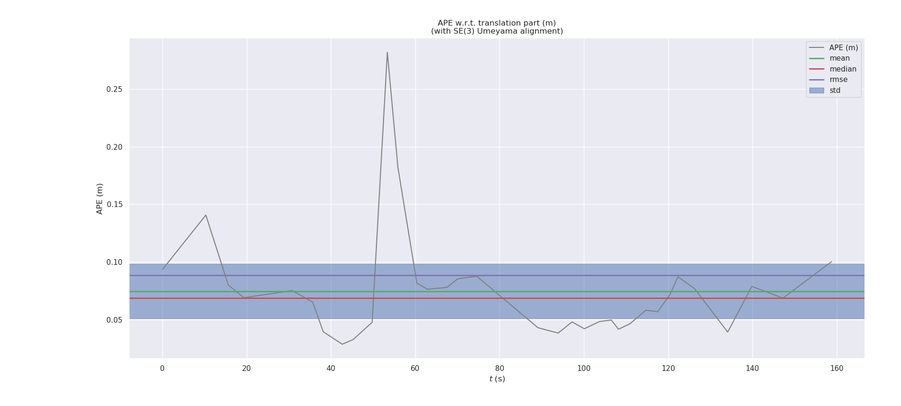</td>
	</tr>
 </table>
</td>
<td>
 <table>
	<tr>
      <td rowspan="5">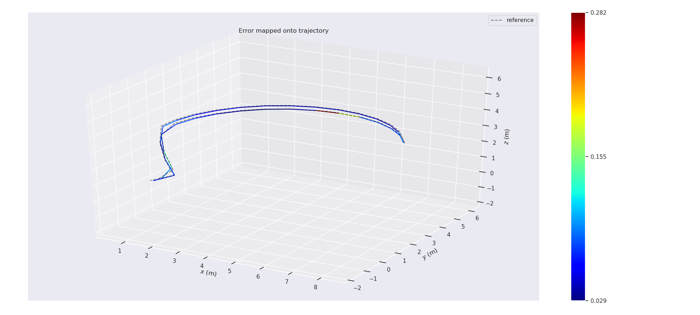</td>
	</tr>
 </table>
</td>
</table>

Fig 5. LIO-SAM

<table>
 <td width="50%">
 <table>
	<tr>
      <td rowspan="5">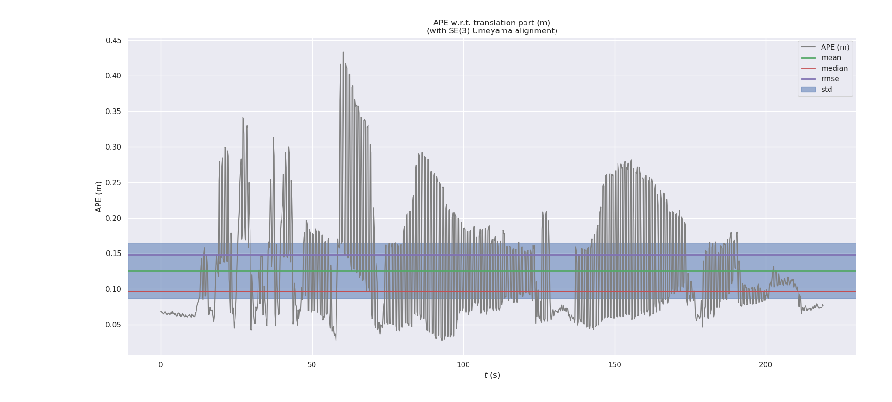</td>
	</tr>
 </table>
</td>
<td>
 <table>
	<tr>
      <td rowspan="5">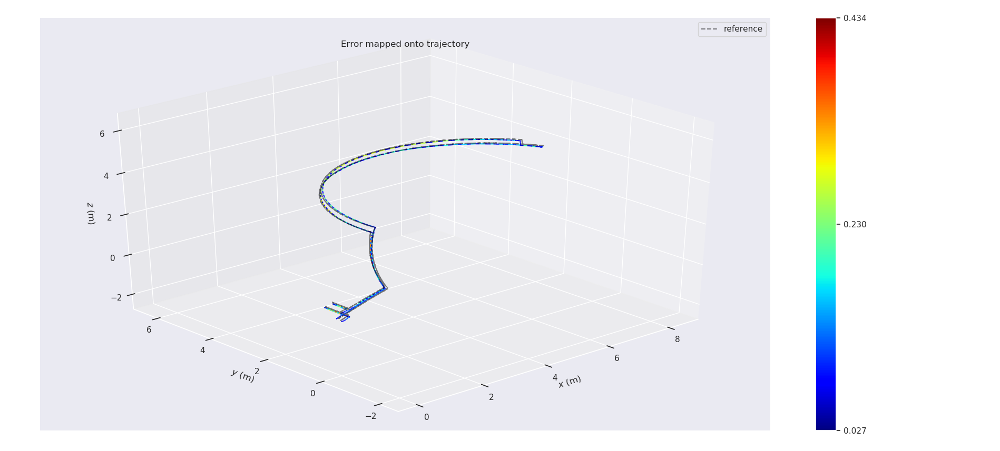</td>
	</tr>
 </table>
</td>
</table>

Fig 6. FAST-LIO Velo
