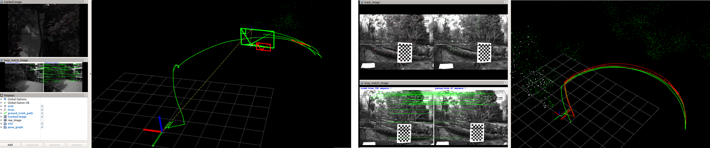
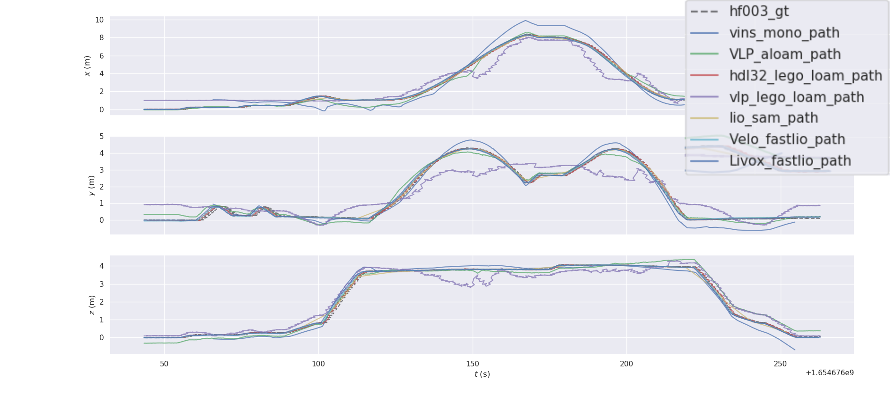

{: #toc }
*  TOC
{:toc}

### FAST-LIO
**FAST-LIO for USTC FLICAR:**
<a href="https://github.com/ustc-flicar/ustcflicar-FAST-LIO">https://github.com/ustc-flicar/ustcflicar-FAST-LIO</a> 
**Credit:** Forked from <a href="https://github.com/hku-mars/FAST_LIO">https://github.com/hku-mars/FAST_LIO</a> 

    

Left:FAST-LIO with Velodyne HDL32E data and Xsens MTi-G-710 data from HF003 sequence Right: FAST-LIO with LiVOX Avia(Lidar and imu) data from HF003 sequence 

### VINS-Mono / VINS-Fusion

Note: When we collect data, we start the sensors in order. Before starting a sensor, program need to check whether the previous sensor is working properly. So at the beginning of the rosbag, not all sensors have finished starting. When using a sensor fusion algorithm (such as camera-IMU), you can play rosbag for a period of time (about 10s), and then start the algorithm after all the sensors are started to prevent initialization errors.

**VINS-Mono for USTC FLICAR:**
<a href="https://github.com/ustc-flicar/ustcflicar-VINS-Mono">https://github.com/ustc-flicar/ustcflicar-VINS-Mono</a> 
**Credit:** Forked from <a href="https://github.com/HKUST-Aerial-Robotics/VINS-Mono">https://github.com/HKUST-Aerial-Robotics/VINS-Mono</a>

**VINS-Fusion for USTC FLICAR:**
<a href="https://github.com/ustc-flicar/ustcflicar-VINS-Fusion">https://github.com/ustc-flicar/ustcflicar-VINS-Fusion</a> 
**Credit:** Forked from <a href="https://github.com/HKUST-Aerial-Robotics/VINS-Fusion">https://github.com/HKUST-Aerial-Robotics/VINS-Fusion</a>

    

Left:VINS-Mono with Hikvision1 data and Xsens MTi-G-710 data from HF003 sequence Right: VINS-Fusion with Bumblebee-xb3-Left/Right data and Xsens MTi-G-710 data from HF003 sequence

### ORB-SLAM3

Note:We found that different versions of ORB SLAM3 codes have different configuration requirements and operating effects in different system environments. We provide two versions of ORB_SLAM3 codes that adapted to our experimental environment (Ubuntu 18.04, ROS melodic).

**ORB-SLAM3 for USTC FLICAR (IMU):**
<a href="https://github.com/ustc-flicar/ustcflicar-ORB-SLAM3-IMU">https://github.com/ustc-flicar/ustcflicar-ORB-SLAM3-IMU</a> 
**ORB-SLAM3 for USTC FLICAR (no IMU):**
<a href="https://github.com/ustc-flicar/ustcflicar-ORB-SLAM3-no-IMU">https://github.com/ustc-flicar/ustcflicar-ORB-SLAM3-no-IMU</a> 
**Credit:** Forked from <a href="https://github.com/UZ-SLAMLab/ORB_SLAM3">https://github.com/UZ-SLAMLab/ORB_SLAM3</a> 

    

ORB-SLAM3 with Hikvision1 data and Xsens MTi-G-710 data from HF003 sequence

### A-LOAM
**A-LOAM for USTC FLICAR:**
<a href="https://github.com/ustc-flicar/ustcflicar-A-LOAM">https://github.com/ustc-flicar/ustcflicar-A-LOAM</a> 
**Credit:** Forked from <a href="https://github.com/HKUST-Aerial-Robotics/A-LOAM">https://github.com/HKUST-Aerial-Robotics/A-LOAM</a> 

    

A-LOAM with horizontal Velodyne HDL-32E data from HF003 sequence

    

A-LOAM with vertical Velodyne VLP-32C data from HF003 sequence

### LeGO-LOAM
**LeGO-LOAM for USTC FLICAR:**
<a href="https://github.com/ustc-flicar/ustcflicar-LeGO-LOAM">https://github.com/ustc-flicar/ustcflicar-LeGO-LOAM</a> 
**Credit:** Forked from <a href="https://github.com/RobustFieldAutonomyLab/LeGO-LOAM">https://github.com/RobustFieldAutonomyLab/LeGO-LOAM</a> 

    

LeGO-LOAM with horizontal Velodyne HDL-32E data from HF003 sequence

    

LeGO-LOAM with vertical Velodyne VLP-32C data from HF003 sequence

### LIO-SAM
**LIO-SAM for USTC FLICAR:**
<a href="https://github.com/ustc-flicar/ustcflicar-LIO-SAM">https://github.com/ustc-flicar/ustcflicar-LIO-SAM</a> 
**Credit:** Forked from <a href="https://github.com/TixiaoShan/LIO-SAM">https://github.com/TixiaoShan/LIO-SAM</a> 

    

### Evaluation:EVO
EVO Tools:<a href="https://github.com/MichaelGrupp/evo">https://github.com/MichaelGrupp/evo</a> 

Overview

