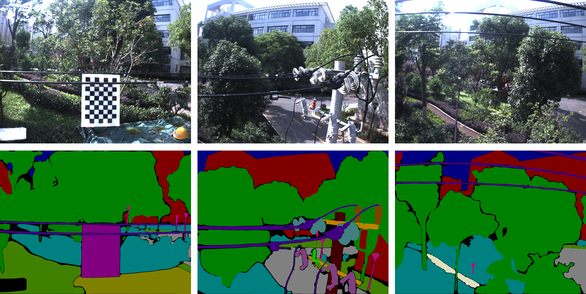
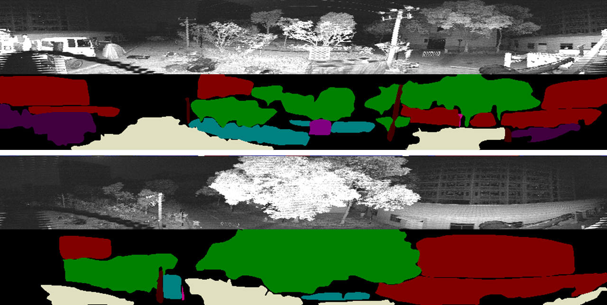
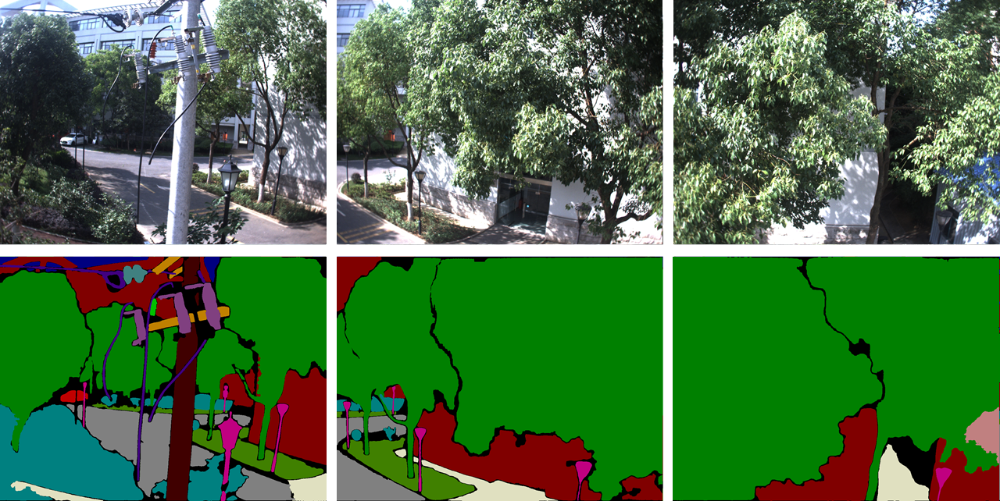
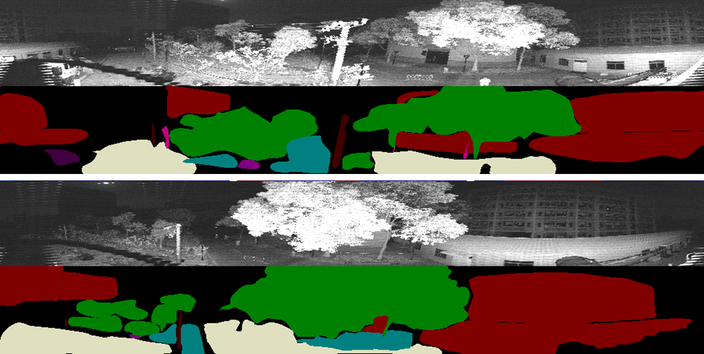
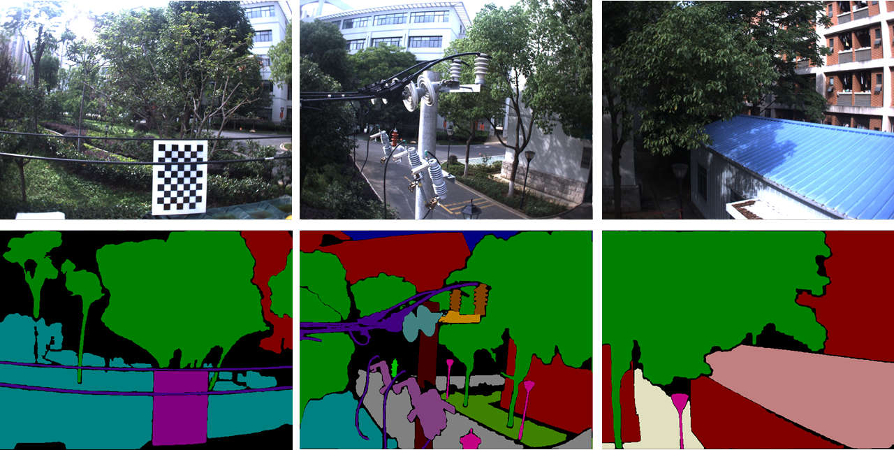
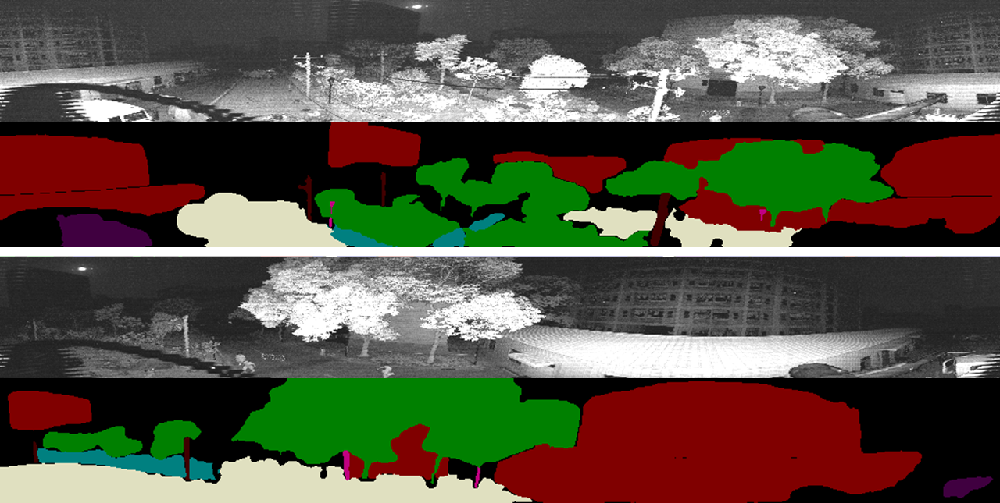
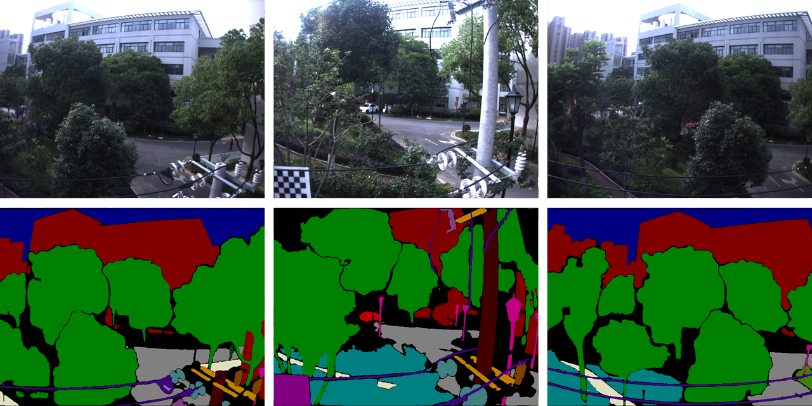
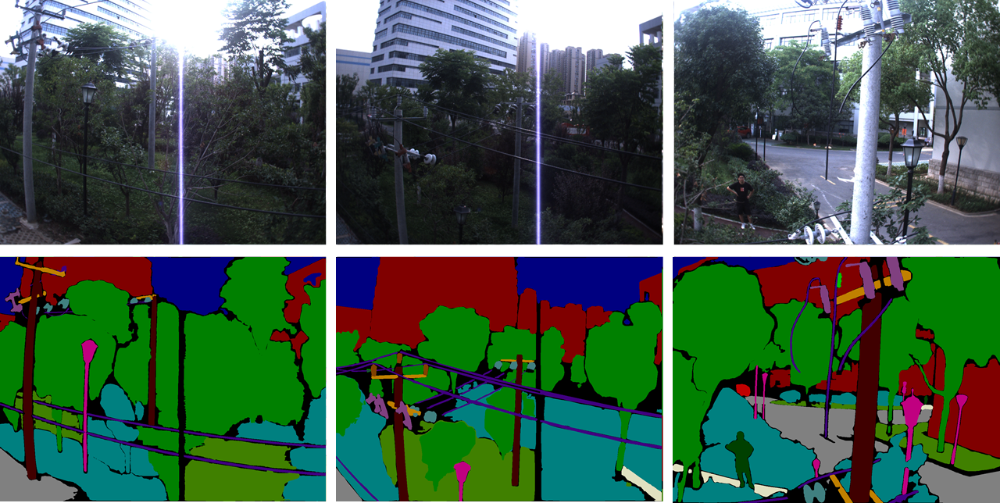
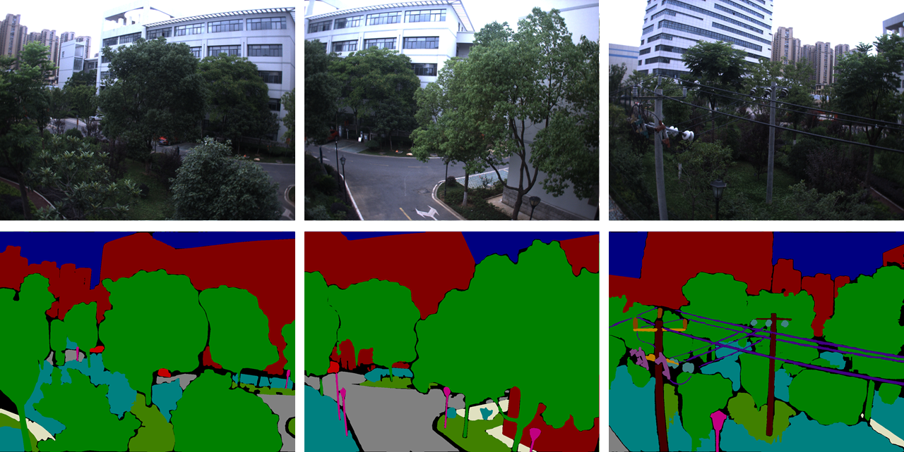

#### We greatly appreciate Meta AI Research, FAIR for their open-source project,<a href="https://github.com/facebookresearch/segment-anything"> Segment Anything </a>, which played a vital role in constructing the Semantic FLICAR dataset.

 

      

         
      

      

         <a href="https://rec.ustc.edu.cn/share/194241c0-0225-11ee-b4d1-f340941dc451">
            <h3>HF001  Bumblebee XB3 Center</h3>
         </a>
      

 

      

         
      

      

         <a href="https://rec.ustc.edu.cn/share/c5519e00-02c0-11ee-8056-533f45044f7e">
            <h3>HF001 Ouster Signal Image</h3>
         </a>
      

 

      

         
      

      

         <a href="https://rec.ustc.edu.cn/share/e66db780-02b4-11ee-9e75-bf8c439878cf">
            <h3>HF002  Bumblebee XB3 Center</h3>
         </a>
      

 

      

         
      

      

         <a href="https://rec.ustc.edu.cn/share/c5519e00-02c0-11ee-8056-533f45044f7e">
            <h3>HF002  Ouster Signal Image</h3>
         </a>
      

 

      

         
      

      

         <a href="https://rec.ustc.edu.cn/share/66cc6540-02b8-11ee-b526-8775d968765d">
            <h3>HF003  Bumblebee XB3 Center</h3>
         </a>
      

 

      

         
      

      

         <a href="https://rec.ustc.edu.cn/share/589fb370-02d1-11ee-adf0-854a6fb08c3a">
            <h3>HF003  Ouster Signal Image</h3>
         </a>
      

 

      

         
      

      

         <a href="https://rec.ustc.edu.cn/share/6060d770-02ba-11ee-9691-17cc55f33ac6">
            <h3>HF004  Bumblebee XB3 Center</h3>
         </a>
      

 

      

         
      

      

         <a href="https://rec.ustc.edu.cn/share/e4bd8c20-02bb-11ee-837c-8b48928dff96">
            <h3>HF005  Bumblebee XB3 Center</h3>
         </a>
      

 

      

         
      

      

         <a href="https://rec.ustc.edu.cn/share/980f0610-02bd-11ee-affc-f12d9537d4ab">
            <h3>HF006  Bumblebee XB3 Center</h3>
         </a>
      

