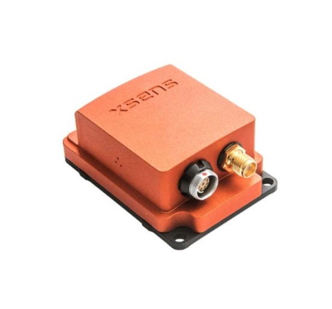
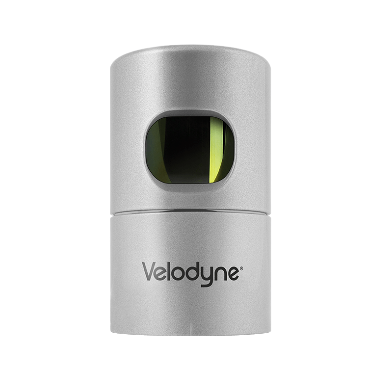
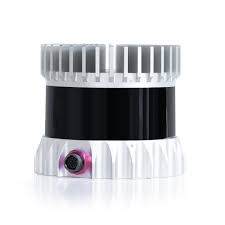
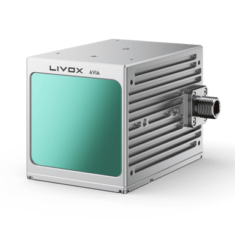
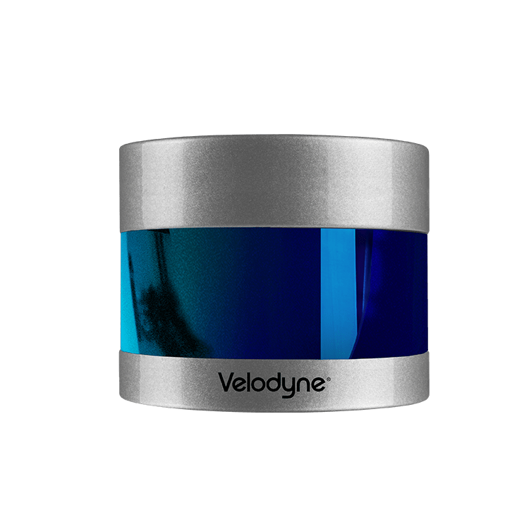
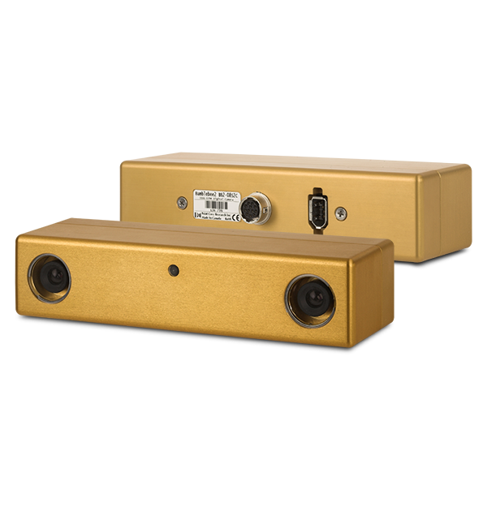
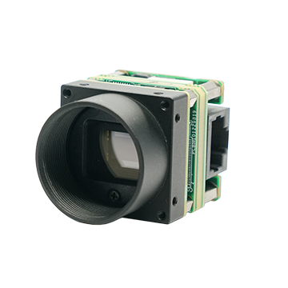
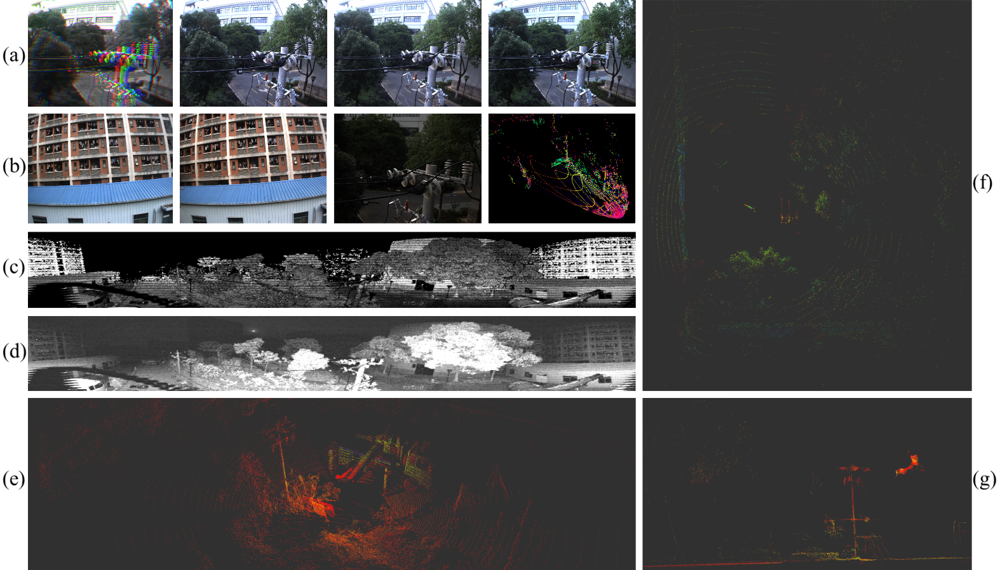
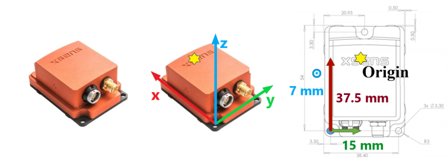
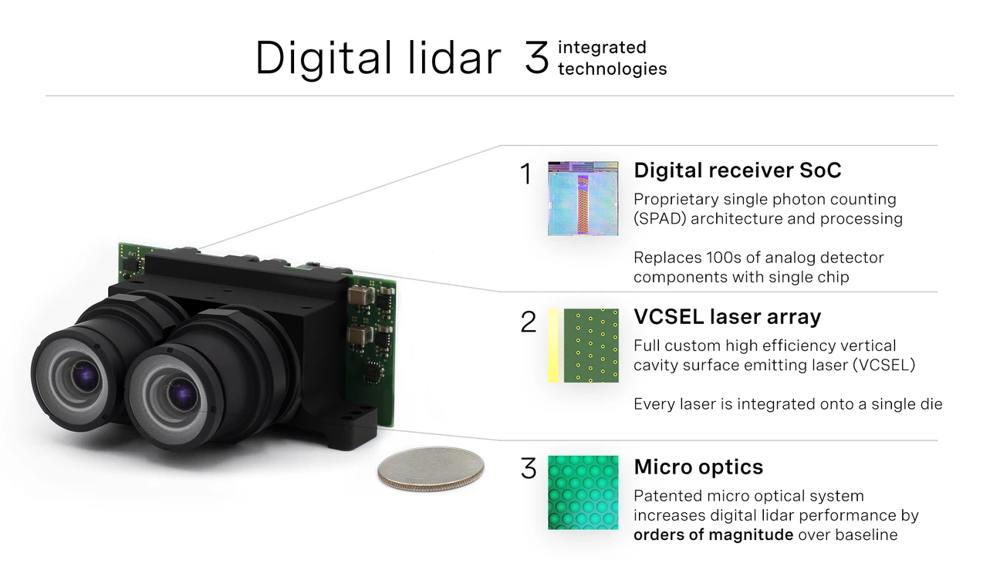

<div class="panel radius" markdown="1">
**Table of Contents**
{: #toc }
*  TOC
{:toc}
</div>

## Overview

The sensor setup is illustrated in [Fig. 1](#fig-harware). The corresponding ROS topics are reported in [Tab. 1](#tab-sensor-and-topic).

<p align="center">
    <td></td>
</p>


<table class="tg">
<thead>
  <tr>
    <th class="tg-c3ow">No.</th>
    <th class="tg-c3ow" width="15%">Sensor</th>
    <th class="tg-c3ow">Manufacturer<br>&amp; Product name</th>
    <th class="tg-c3ow">ROS topic name</th>
    <th class="tg-c3ow">Message Type</th>
    <th class="tg-c3ow" width="10%">Nominal Rate</th>
    <th class="tg-c3ow">Pics</th>
  </tr>
</thead>
<tbody>
  <tr>
    <td class="tg-c3ow" rowspan="1">1</td>
    <td class="tg-c3ow" rowspan="1">IMU/INS</td>
    <td class="tg-c3ow" rowspan="1">Xsens MTi-G-710</td>
    <td class="tg-0pky">/imu/data</td>
    <td class="tg-0pky">sensor_msgs/Imu</td>
    <td class="tg-c3ow">400 Hz</td>
    <td></td>
  </tr>

  <tr>
    <td class="tg-c3ow" rowspan="1">2</td>
    <td class="tg-c3ow" rowspan="1">Horizontal Lidar 1<br>(Mechanical LiDAR)</td>
    <td class="tg-c3ow" rowspan="1">Velodyne HDL32E</td>
    <td class="tg-0pky">/velodyne_points_HDL32</td>
    <td class="tg-0pky">sensor_msgs/PointCloud2</td>
    <td class="tg-c3ow">5 Hz(rotate at 10Hz)</td>
    <td></td>
  </tr>

  <tr>
    <td class="tg-c3ow" rowspan="4">3</td>
    <td class="tg-c3ow" rowspan="4">Horizontal Lidar 2<br>(Digital LiDAR)</td>
    <td class="tg-c3ow" rowspan="4">Ouster OS0-128</td>
    <td class="tg-0pky">/os_cloud_node/imu</td>
    <td class="tg-0pky">sensor_msgs/Imu</td>
    <td class="tg-c3ow">100 Hz</td>
  </tr>

  <tr>
    <td class="tg-0pky">/os_cloud_node/points</td>
    <td class="tg-0pky">sensor_msgs/PointCloud2</td>
    <td class="tg-c3ow">10 Hz</td>
  </tr>

  <tr>
    <td class="tg-0pky">/img_node/reflect_image</td>
    <td class="tg-0pky">sensor_msgs/Image</td>
    <td class="tg-c3ow">10 Hz</td>
    <td></td>
  </tr>

  <tr>
    <td class="tg-0pky">/img_node/signal_image</td>
    <td class="tg-0pky">sensor_msgs/Image</td>
    <td class="tg-c3ow">10 Hz</td>
  </tr>

  <tr>
    <td class="tg-c3ow" rowspan="2">4</td>
    <td class="tg-c3ow" rowspan="2">Horizontal Lidar 3<br>(MEMS LiDAR)</td>
    <td class="tg-c3ow" rowspan="2">LiVOX Avia</td>
    <td class="tg-0pky">/livox/lidar</td>
    <td class="tg-0pky">livox_ros_driver/CustomMsg</td>
    <td class="tg-c3ow">10 Hz</td>
    <td></td>
  </tr>

  <tr>
    <td class="tg-0pky">/livox/imu</td>
    <td class="tg-0pky">sensor_msgs/Imu</td>
    <td class="tg-c3ow">200 Hz</td>
  </tr>

  <tr>
    <td class="tg-c3ow" rowspan="1">5</td>
    <td class="tg-c3ow" rowspan="1">Vertical Lidar 1<br>(Mechanical LiDAR)</td>
    <td class="tg-c3ow" rowspan="1">Velodyne VLP32C</td>
    <td class="tg-0pky">/velodyne_points_VLP32</td>
    <td class="tg-0pky">sensor_msgs/PointCloud2</td>
    <td class="tg-c3ow">10Hz</td>
    <td></td>
  </tr>

  <tr>
    <td class="tg-c3ow" rowspan="3">6</td>
    <td class="tg-c3ow" rowspan="3">Stereo Camera front</td>
    <td class="tg-c3ow" rowspan="3">PointGrey Bumblebee xb3</td>
    <td class="tg-0pky">/camera/left/image_raw</td>
    <td class="tg-0pky">sensor_msgs/Image</td>
    <td class="tg-c3ow">10 Hz</td>
  </tr>

  <tr>
    <td class="tg-0pky">/camera/center/image_raw</td>
    <td class="tg-0pky">sensor_msgs/Image</td>
    <td class="tg-c3ow">10 Hz</td>
    <td></td>
  </tr>

  <tr>
    <td class="tg-0pky">/camera/right/image_raw</td>
    <td class="tg-0pky">sensor_msgs/Image</td>
    <td class="tg-c3ow">10 Hz</td>
  </tr>

  <tr>
    <td class="tg-c3ow" rowspan="2">7</td>
    <td class="tg-c3ow" rowspan="2">Stereo Camera back</td>
    <td class="tg-c3ow" rowspan="2">PointGrey Bumblebee xb2</td>
    <td class="tg-0pky">/cam_xb2/left/image_raw</td>
    <td class="tg-0pky">sensor_msgs/Image</td>
    <td class="tg-c3ow">10-15 Hz</td>
    <td></td>
  </tr>

  <tr>
    <td class="tg-0pky">/cam_xb2/right/image_raw</td>
    <td class="tg-0pky">sensor_msgs/Image</td>
    <td class="tg-c3ow">10-15 Hz</td>
  </tr>

  <tr>
    <td class="tg-c3ow" rowspan="1">8</td>
    <td class="tg-c3ow" rowspan="1">Mono Camera 1<br>(With HDL32E)</td>
    <td class="tg-c3ow" rowspan="1">Hikvision MV-CB016-10GC-C</td>
    <td class="tg-0pky">/hik_camera/iamge_raw</td>
    <td class="tg-0pky">sensor_msgs/Image</td>
    <td class="tg-c3ow">20Hz</td>
    <td></td>
  </tr>

  <tr>
    <td class="tg-c3ow" rowspan="1">9</td>
    <td class="tg-c3ow" rowspan="1">Mono Camera 2<br>(With LiVOX Avia)</td>
    <td class="tg-c3ow" rowspan="1">Hikvision MV-CE060-10UC</td>
    <td class="tg-0pky">/right_camera/iamge_raw</td>
    <td class="tg-0pky">sensor_msgs/Image</td>
    <td class="tg-c3ow">20Hz</td>
    <td></td>
  </tr>
</tbody>
</table>

<table>
<tr>
<td></td>
</tr>
</table>
<p style="text-align: center;">Visualization of multi-sensor data, at the same time. (a) Bumblebee-XB3 raw bayer image, left, center, right views. (b) Bumblebee-XB2 left,right views; Hikvision camera; LiVOX Avia pointclouds. (c) reflect image of Ouster OS0-128. (d) signal image of
Ouster OS0-128. (e) Ouster OS0-128 pointclouds. (f) Horizontal Velodyne HDL32E pointclouds. (g) Vertical Velodyne VLP32C pointcloud </p> <a name="fig-hardware"></a>


## IMU
The IMU we use is Xsens MTi-G-710. It is a 9-DoF inertia sensor which gives roll, pitch, and yaw estimatio. 9-DoF IMU data is necessarily for some slam algorithms such as <a href="https://github.com/TixiaoShan/LIO-SAM">LIO-SAM</a>, our data can meet the requirment. Xsens outputs the three-axis acceleration and three-axis angular velocity in its own coordinate system, and the quaternion attitude in the north-east-down (NED) coordinate system. Xsens is hardware synchronized to the same external GPS clock source with the cameras and Lidars in the system, making up visual-inertial and Lidar-inertial sensor units together. Two extra 6 axis IMUs are in OS0-128 and LiVOX Avia Lidars, as part of Lidar-Inertial sensor unit.

For more information of Xsens MTi-G-710：
<a href="../pdf/MTi_usermanual.pdf">User Manual of Xsens_MTi</a>

• Xsens MTi-G-710 INS/GNSS, 9 axis, 400 Hz, accuracy: 0.2° in roll/pitch, 0.8° in heading.

<table>
<tr>
<td></td>
</tr>
</table>
<p style="text-align: center;">Fig 2. The IMU frame of reference </p> <a name="fig-hardware"></a>

## Mechanical Lidar
There are two Velodyne Mechanical Lidars in the system, Horizontal Lidar 1 — Velodyne HDL-32E and Vertical Lidar — Velodyne VLP-32C.

### Horizontal Lidar 1
The first horizontal Lidar in the middle of the multisensors platform is Velodyne HDL-32E.
<a href="../pdf/MANUAL_USERS_HDL32E.pdf">User Manual of Velodyne_HDL_32E</a>

In the actual work process, the point cloud accuracy of Velodyne
HDL32E is the highest. 

• Velodyne HDL-32E, 5/10 Hz, 32
beams, 1.33◦ angular resolution, ± 2 cm distance accuracy,
collecting 1.39 million points/second, field of view: 360◦
HFoV, 41.3◦ VFoV (+10.67◦ to −30.67◦), range: 100 m

### Vertical Lidar
Vertical Lidar is Velodyne VLP-32C(Ultra Puck).<a href="../pdf/VLP32CManual.pdf">User Manual of Velodyne_VLP_32C</a><br> 

Velodyne VLP32C is installed vertically on the side of the acquisition system
to supplement the blind area of vision. The aerial robot
moves in three dimensions, and objects such as wires and
branches may suddenly appear in all directions of the robot
as obstacles. Therefore, the robot needs 720 degrees of
perception in the horizontal and vertical directions. Besides,
since the objects above the robot are few and small, there
may only a few points in the point cloud within 180 degrees
above the Lidar.

• Velodyne VLP-32C, 10 Hz, 32
beams, 0.33◦ angular resolution (non-linear distribution), ±3
cm distance accuracy, collecting 1.20 million points/second,
field of view: 360◦ HFoV, 40◦ VFoV (−25◦ to +15◦), range:
200 m

*Definition of the Velodyne point type:*
```cpp
struct PointXYZIRT
{
    PCL_ADD_POINT4D
    PCL_ADD_INTENSITY;
    uint16_t ring;
    float time;
    EIGEN_MAKE_ALIGNED_OPERATOR_NEW
} EIGEN_ALIGN16;

POINT_CLOUD_REGISTER_POINT_STRUCT (PointXYZIRT,  
                                    (float, x, x) 
                                    (float, y, y) 
                                    (float, z, z) 
                                    (float, intensity, intensity)
                                    (uint16_t, ring, ring) 
                                    (float, time, time))
```


## Digital Lidar
About digital lidar:
<td></td>
Ouster Company Said:<a href="https://ouster.com/blog/why-digital-lidar-is-the-future/">https://ouster.com/blog/why-digital-lidar-is-the-future/</a>

### Horizontal Lidar 2

The second horizontal Lidar in the middle of the multisensors platform is Ouster OS0-128. Ouster OS0-128 Lidar is a
digital Lidar. Digital Lidar is based on custom system-on-a-
chip (“SoC”) with single photon avalanche diode (“SPAD”)
detectors. Therefore, it can not only output pointclouds,
but also output depth images and signal-intensity images of
Lidar and visible light spectrum.

*Definition of the Ouster point type:*
```cpp
struct PointXYZIRT
{
    PCL_ADD_POINT4D;
    float intensity;
    uint32_t t;
    uint16_t reflectivity;
    uint8_t  ring;          // The channel index
    uint16_t noise;
    uint32_t range;         // The distance measurement
    EIGEN_MAKE_ALIGNED_OPERATOR_NEW
} EIGEN_ALIGN16;

POINT_CLOUD_REGISTER_POINT_STRUCT(PointXYZIRT,
                                  (float, x, x)
                                  (float, y, y)
                                  (float, z, z)
                                  (float, intensity, intensity)
                                  (uint32_t, t, t)
                                  (uint16_t, reflectivity, reflectivity)
                                  (uint8_t,  ring, ring)
                                  (uint16_t, noise, noise)
                                  (uint32_t, range, range))
```

## MEMS Lidar
We Use DJI LiVOX Avia Lidar in our dataset. It is mounted horizontally on the sensor platform. The main characteristics of LiVOX Avia is that it has a view like camera and the mode of non-repetitive scanning. Pointclouds from LiVOX Lidar scans are uniformly accumulated on the map over time.
<br>

<iframe src="../video/avia_scan.mp4" frameborder="0" allowfullscreen style="width:50%;height:330px;" ></iframe>

Livox customized data package format, as follows:
```cpp
Header header             # ROS standard message header
uint64 timebase           # The time of first point
uint32 point_num          # Total number of pointclouds
uint8  lidar_id           # Lidar device id number
uint8[3]  rsvd            # Reserved use
CustomPoint[] points      # Pointcloud data
```
Customized Point Cloud (CustomPoint) format in the above customized data package:
```cpp
uint32 offset_time      # offset time relative to the base time
float32 x               # X axis, unit:m
float32 y               # Y axis, unit:m
float32 z               # Z axis, unit:m
uint8 reflectivity      # reflectivity, 0~255
uint8 tag               # livox tag
uint8 line              # laser number in lidar
```

## Mono and Stereo Cameras
Cameras are an important part of autonomous system
perception, as they capture high resolution images of
the surrounding environment, providing information about
object shape, color, texture, and motion direction. And
stereo cameras can effectively recover depth. We equipped
the sensor platform with several cameras, including stereo
cameras and monocular cameras:

• 1 x Point Grey Bumblebee XB3 (BBX3-13S2C-38)
trinocular stereo camera, 1280 × 960 × 3, 10Hz, Sony
ICX445 CCD, 1/3, 3.75 m, global shutter, 3.8mm lens, 66◦
HFoV, 12/24cm baseline, IEEE 1394B, 54 dB Signal To
Noise Ratio (SNR).

• 1 x Point Grey Bumblebee XB2 (BBX2-08S2C-38)
binocular stereo camera, 1024 x 768 × 2, 10-15Hz, Sony
ICX204 CCD, 1/3, 4.65 μm, global shutter, 3.8mm lens, 70◦
HFoV, 12cm baseline, IEEE 1394A, 60 dB SNR.

• 1 x Hikvision MV-CB016-10GC-C industrial monocular
camera, 1440 × 1080, 20Hz, Sony IMX296 CCD, 1/2.9, 3.45 m, global shutter, 6mm lens (MVL-HF0628M-6MPE),
63.11◦ HFoV, GigE, 41 dB SNR.

• 1 x Hikvision MV-CE060-10UC industrial monocular
camera, 3072×2048, 20Hz, Sony IMX178 CCD, 1/1.8”, 2.4
μm, global shutter, 6mm lens (MVL-HF0628M-6MP), 49.3◦
HFoV, USB 3.0, 41.3 dB SNR.

Note tha images are stored with loss-less
compression using 8-bit PNG files. When collecting data,
we only record the original images in Bayer format, and do
not perform parsing, compression, or filtering (such as Bayer
demosaicing), in order to preserve the original information
of the data to the greatest extent and improve data utility.
For example, as shown in Figure below, the three views from
the left, center and right camera of Bumblebee-XB3 are
encoded in the red, green and blue channels respectively, and
logged to the disk as one Bayer format image. We perform
operations such as view separation and Bayer demosaicing
offline for the raw image, which strictly guarantees the
timestamp and brightness consistency of stereo camera
images because they were logged to the disk exactly at the
same time in one image. Images of each view are provided
separately in the *left/center/right* folder under the
*xb3* folder.
<p align="center">
    
</p>


## Laser Tracker
The ground truth measurements of position is provided by API T3 Laser Tracker. The laser tracker is fixed horizontally on the ground and is the only sensor that is independent of the overall sensor system. During the motion of the sensor platform, the laser tracker tracks the active target ball that rigidly fixed on the platform body, and outputs the three-dimensional space coordinates of the target point with millimeter precision in its own coordinate system.
<a href="https://www.adm3d.com/Home/T3Tracker">https://www.adm3d.com/Home/T3Tracker</a>

